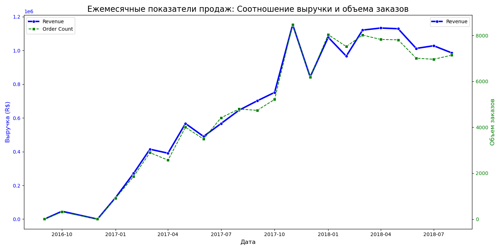
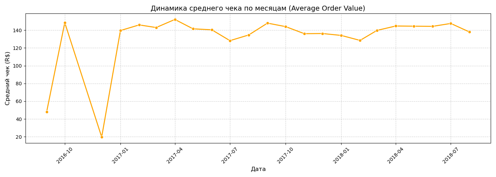
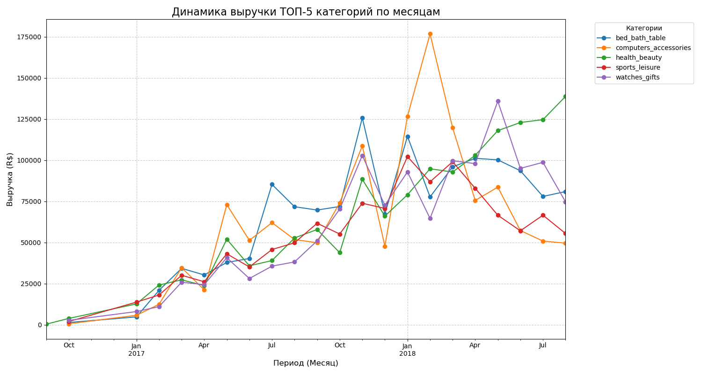
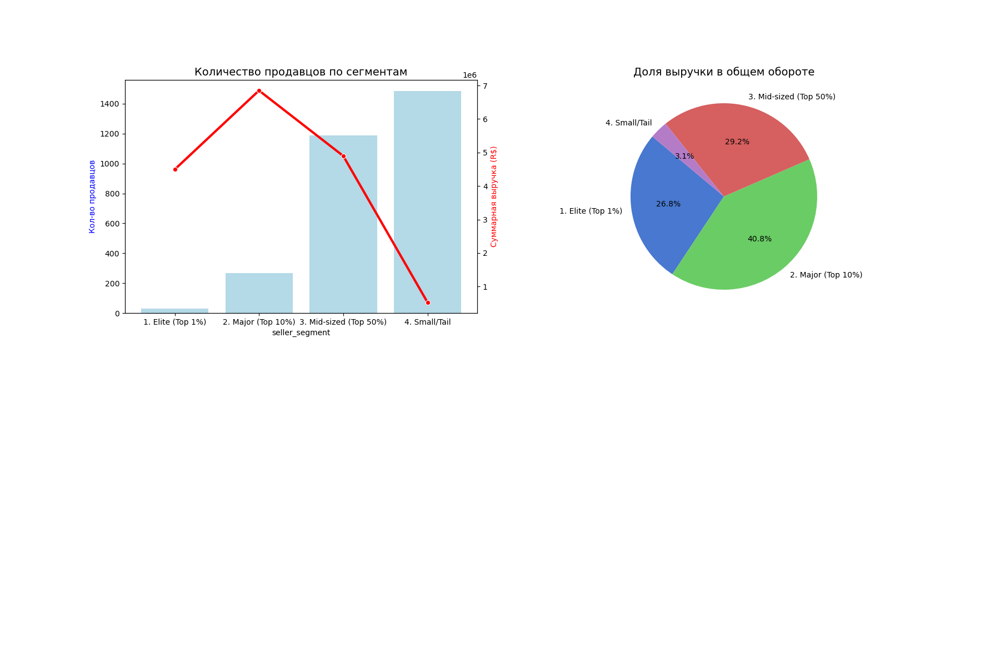
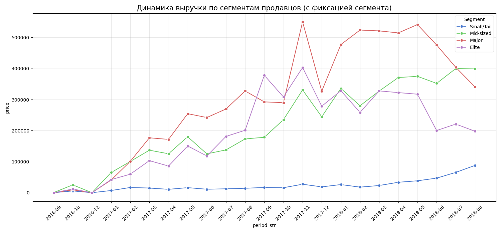

# Анализ продаж бразильского маркетплейса Olist
[English version](README_EN.md)
## Кратко о проекте 
Анализ данных e-commerce ([Olist](https://www.kaggle.com/datasets/terencicp/e-commerce-dataset-by-olist-as-an-sqlite-database)).
- 53.5% выручки формируют клиенты сегментов Gold и Silver  
- Основные категории: health_beauty, watches_gifts  
- Наблюдается концентрация выручки у части продавцов  
### Данные
 - Источник: Olist e-commerce dataset (Kaggle)  
 - Объём: ~100k заказов  
### Инструменты: 
 - Python (Pandas), 
 - SQL
## Анализ продаж бразильского маркетплейса Olist.
### Бизнес-цели анализа:
 - выявить структуру выручки,
 - ключевые клиентские сегменты,
 - наиболее прибыльные категории товаров,
 - эффективность продавцов.
### В анализе использованы таблицы:
 - customers
 - orders
 - order_items
 - products 
### Объединение таблиц выполнено по ключам:
 - customer_id
 - order_id
 - product_id
### Выручка рассчитана как:
 `revenue = price + freight_value`
### Применённые методы:
 - очистка и проверка данных
 - объединение таблиц (merge)
 - группировки и агрегации (groupby, agg)
 - сегментация клиентов
 - анализ вклада категорий
 - визуализация данных

## Использованные инструменты
 - Python
 - Pandas
 - NumPy
 - Matplotlib
 - Jupyter Notebook
 - SQL(часть анализа продублирована в SQL,DBeaver).

## Основные результаты
### Клиентская сегментация:
 - Gold
 - Silver
 - Regular
 **Выводы:**
 - Gold + Silver формируют 53,5% общей выручки.
 - Regular (80% клиентской базы) обеспечивает 46,5% выручки.
 - Компания имеет устойчивую массовую аудиторию и выраженный сегмент лояльных клиентов.
### Категории товаров-лидеров по выручке:
 - health_beauty
 - watches_gifts
 - также значительный вклад вносят: bed_bath_table, computers_accessories
 **Вывод:** Есть потенциал расширения ассортимента в лидирующих категориях и необходимость учитывать сезонность при планировании запасов.
### Продавцы
 - сегменты Elite и Major (10% продавцов) обеспечивают 47,6% выручки, что подтверждает высокую концентрацию оборота в узком ядре селлеров.
 - сегмент Small/Tail отличается высокой фрагментацией, создавая дополнительную нагрузку на операционные процессы.
 - сегменты Elite и Mid-sized демонстрируют устойчивый тренд, тогда как Major характеризуется большей чувствительностью к краткосрочным факторам.
**Вывод:**
 - целесообразно внедрить систему мотивации для топ-продавцов.
 - разработать программу развития для продавцов среднего сегмента.
## Визуализация
### Динамика продаж
График отражает изменение выручки и количества заказов во времени.

### Динамика среднего чека по месяцам
График отражает изменение покупательского поведения во времени.

### Вклад TOP-5 категорий товаров в выручку по времени 
График иллюстрирует вклад наиболее значимых категорий товаров по объёму выручки по времени.

### Разделение продавцов по вкладу в выручку
График отражает какой процент продавцов делают наибольшие продажи

### Динамика выручки по сегментам продавцов с фиксацией сегмента
На графике в динамике отражен вклад в общий оборот сегментов продавцов

## Бизнес-рекомендации
 - Внедрение программ лояльности для Gold и Silver клиентов.
 - Работа с Regular сегментом по увеличению среднего чека.
 - Расширение ассортимента в ключевых категориях.
 - Оптимизация логистики с учётом сезонного спроса.
 - Мотивационные программы для продавцов.

## Структура проекта

olist-sales-analysis/

├── data/

├── notebooks/

│   └── olist_analysis.ipynb

├── images/

├── README.md

├── README_EN.md

└── requirements.txt

## Что демонстрирует проект:
 - Умение работать с несколькими связанными таблицами
 - Понимание бизнес-логики анализа
 - Навыки расчёта выручки и сегментации
 - Формирование практических рекомендаций на основе данных
